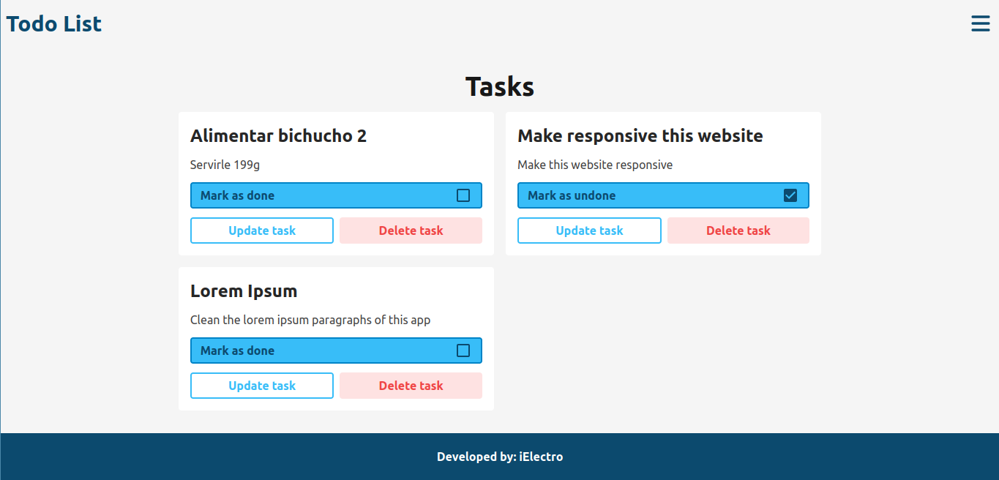
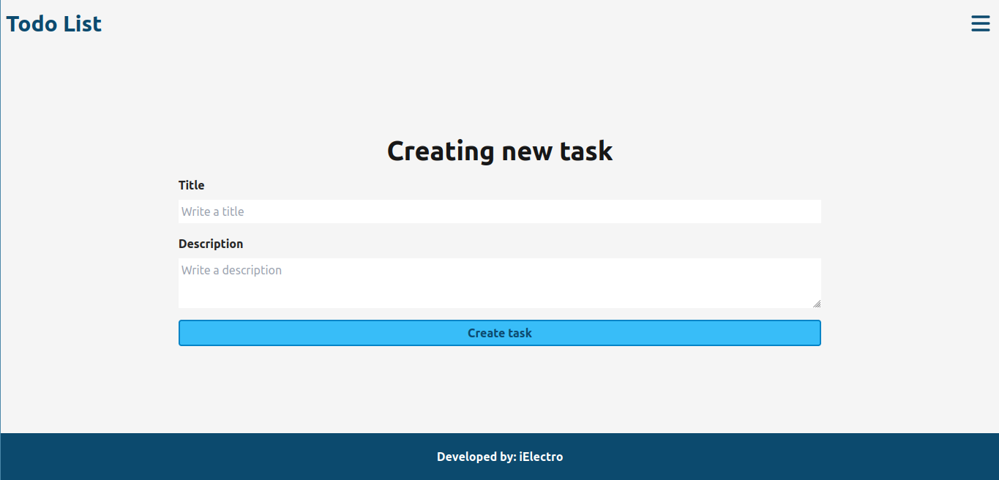
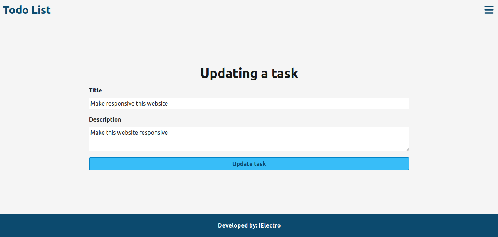

# My first todo app

This is my first todo app with an express backend.





## Deploy
[My first todo list](https://my-first-todo-app.vercel.app/ "EM: Hecho a mano")

## Installation
```bash
git clone https://github.com/iElectro13/todo-frontend
```

```bash
cd todo-frontend
```

```
npm install
```

## Usage

```bash
npm run dev
```

## Third-party's libraries
- [react-router-dom](https://github.com/remix-run/react-router#readme "react-router-dom")
- [react-icons](https://react-icons.github.io/react-icons/ "react-icons")
- [tailwindcss](https://tailwindcss.com/ "tailwindcss")

## Roadmap

1) Auth with JWT
2) Admin panel
3) User registration


## Global state management
In this project was used ContextAPI and useReducer working together to handle the global state.

## Main features

- Create new task
- Remove task
- Check and uncheck task
- Update task

## Directories
- assets/ : In this folder i’m going to place static files, like images, fonts, vídeos and
many others utility files.
- components/ : every component will be placed in this folder. Inside this folder i am
going to organize another folders by component category, like buttons, cards, etc.
- buttons/, cards/... : inside this kind of folders will be placed single React Components
beside it’s Test file.
- pages: In this folder all “pages” will be placed. In this project, “pages” means
complete sections, in order to route them later, so the user can navigate as any web
page.
- context/: In this folder i'm going to store the Context and Reducers files.


## Class components vs Functional components
In this project, functional components will be used. It’s completely prohibited to use class
components.

## Contributing
Pull requests are welcome. For major changes, please open an issue first to discuss what you would like to change.

## Authors
[iElectro](https://github.com/iElectro13 "iElectro")
